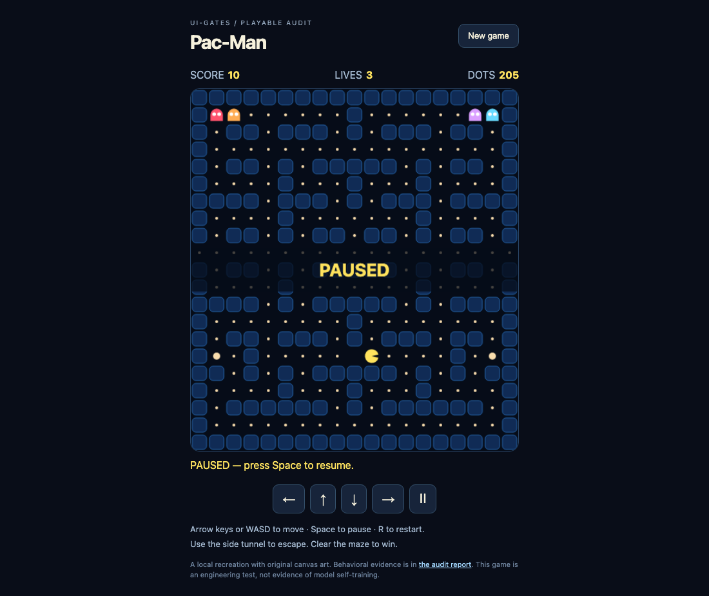

# UI-GATES audit: Pac-Man and synthesis

**Verdict: persistent reuse works in a bounded deterministic experiment. General coding-agent learning is not established, and the reference engine has reproducible correctness gaps.** It would be misleading to call this audit proof that UI-GATES reliably learns from arbitrary software work.

Audited September 18, 2026. The [live public page](https://gerardoiornelas.com/uig/) was fetched successfully; [its captured text](public-page.txt) and [HTML](public-page.html) are preserved. This is an audit of the local checkout, including pre-existing uncommitted work, not an assertion about which engine revision is deployed. No production service was modified. The original game and core implementation were preserved.

## What the website promises, and which implementation owns it

The public page describes a skill-guided workflow, explicitly limits implemented experiential learning to receipt authoring, and says a real coding-agent transfer comparison remains necessary. It distinguishes persistent memory from model retraining and does not claim its earlier fixed-guidance token comparison proves learning. Those qualifications are appropriate.

There are three different things here:

| Layer | Actual behavior | Audit conclusion |
|---|---|---|
| Portable `uig` Markdown skill | Instructs an agent to discover, verify, record and synthesize. Plugin manifest registers skills. | Guidance is present; it does not invoke the TypeScript engine or install an autonomous learner. Skill consistency check passes. Public-download usage logging was not independently tested. |
| `uigates` TypeScript reference engine | Stores authorized receipts, creates Markdown packs, and reads them back. Test workers decide how to use packs. | Persistence and reuse demonstrably work, with important trust and correctness limits below. |
| Sibling portfolio repository's receipt-learning harness | Captures receipt-schema failures/corrections, creates candidates, evaluates paired tasks, checks approvals/freshness and retires lessons. | 53 learning, recoverability and usage tests pass. This is the implementation associated with the site's receipt-authoring claim; it is not a general Pac-Man coding agent. |

The architecture graph contains 279 nodes and 860 edges from code-only extraction. It is a retrieval aid, not validation evidence. One manifest file produced no nodes. The source inspection confirms that the CLI has no synthesis command, the sample loop uses a mock worker, and game experiments supply their own consumers of `loadKnowledge`.

## Pac-Man recreation

The original `examples/pacman` was already in the checkout. I preserved it and created [a separate playable recreation](../../examples/pacman-audit/index.html) with keyboard/touch controls, four ghosts, side tunnels, power pellets, three lives, pause, restart and terminal states. The game uses original canvas rendering and a simplified deterministic simulation, not arcade-perfect ghost behavior.

The [baseline runner](baseline.mjs) executes the original JavaScript in a VM with a minimal DOM/canvas stub; it does not decide pass/fail by reading source text.

| Existing game behavior | Expected | Observed |
|---|---|---|
| Move left from tunnel edge | Wrap to column 18 | Stayed at column 0 |
| Player and ghost cross in one tick | Collision/loss | Game stayed playing |
| Lethal contact while final pellet disappears | Loss | Win overwrote loss |
| Score a dot | +10 | +10 |
| Move into a wall | Stay put | Stayed put |
| Reachability of all pellets | No unreachable pellets | None |

The recreated game passes **19/19 behavioral checks**, including those three cases, legal movement through the full maze until victory, scoring only once, queued turns, power expiration, seeded ghost determinism, and 10,000 step calls checking position and pellet-count invariants. Terminal-state calls may be no-ops; this is not 10,000 frames of continuous survival.

It also passes **7/7 real Chromium checks**: desktop rendering, keyboard scoring, pause, restart, direction buttons, mobile viewport fit and no runtime errors. Chromium version and results are in [browser-checks.json](browser-checks.json). Desktop and mobile screenshots were visually inspected. Full-maze clear uses ghosts disabled to isolate reachability; it is not a human playability or difficulty study.



## Controlled synthesis experiment

The [plan](plan.json) was written before the experiment. The [worker](experiment.ts) selects among three executable behaviors for each of tunnel handling, collision handling and terminal-state precedence. Selection is deterministic from a seed. It receives no correctness flag: the [behavioral verifier](behavior.mjs) executes the game simulation to judge each attempt.

For each of 60 seeds, a discovery run tries candidates, records real verifier outcomes under fixture-issued authority, and calls the actual `CESynthesizer`. Six subsequent corridor-width variants each run with three conditions:

1. **Control:** no prior packs.
2. **Memory:** only the discovery packs copied to disk; a fresh store/ledger/consumer reads them and prioritizes the recorded action IDs.
3. **Memory removed:** the same candidate order, with no packs.

All arms execute the same checks. Control and memory-removed arms receive exactly the same candidate permutations. Arm order alternates by case. No holdout results are synthesized, so later cases cannot learn from earlier evaluation cases. After a failed attempt, every retry supplies the failed receipt, root cause and proposed revision to the governance engine. Fixture principal strings are simulation plumbing, not authenticated human approvals.

| Condition | Builds | Accepted | Executed attempts | Failed attempts | Attempts/build |
|---|---:|---:|---:|---:|---:|
| Discovery | 60 | 60 | 358 | 178 | 5.967 |
| Control | 360 | 360 | 2,174 | 1,094 | 6.039 |
| Memory | 360 | 360 | 1,080 | 0 | 3.000 |
| Memory removed | 360 | 360 | 2,174 | 1,094 | 6.039 |

**Observed effect: 50.32% fewer candidate executions after discovery.** Removing the packs exactly restores control behavior in every pair. This is direct evidence that persisted receipt-derived choices caused the change in this worker's behavior. All 1,140 builds completed, with 5,786 actual candidate executions across discovery and all arms.

Training is not free: the table retains its 358 attempts and 178 failures. Adding those attempts to the memory arm gives 1,438 executions versus 2,174 control executions, a 33.85% reduction under this particular six-reuses-per-seed accounting. This excludes the cost of authoring the game, candidates, verifier, synthesis machinery and audit; it is not a total development-cost estimate.

The mechanism learns **which supplied candidate previously passed**. It does not invent a new algorithm, derive a semantic repair from a failure, retrain model weights, or autonomously alter the installed skill. The holdouts vary corridor width but share the same rules and candidate implementations; they are parameter-transfer cases, not six novel coding problems. The benchmark author also wrote the worker and verifier. Many seeds reduce dependence on candidate ordering, not uncertainty about generalization to real development.

There are **no measured coding-agent token or billing savings**. `modelTokenUsage` is explicitly null. Fresh consumers are new instances in the same process, not independently blinded coding agents. Task-level packs are intentionally reused inside this bounded experiment; that does not establish the public harness's approval-before-live-reuse contract.

Raw evidence: [summary](summary.json), [every build as CSV](results.csv), [every build as JSON](results.json), [per-attempt executed checks](attempts.json), [intent/proposal/authorization/receipt records](execution-records.jsonl), and [saved discovery packs](discovery-memory/knowledge/compound_packs/).

## Eight reproducible weaknesses in the reference engine

The existing suites pass, but independent probes expose missing coverage. [safety-probes.json](safety-probes.json) records expected versus actual behavior for all eight. Six are correctness/validation findings; two concern documented trust boundaries. These findings apply to the TypeScript reference engine, not automatically to the separate portfolio learner.

| Priority | Finding and observed consequence | Source | Recommended correction |
|---|---|---|---|
| P1 | **Receipt ingestion order overrides evidence time.** A newer failure marks a pack conflicted; an older, previously unseen success restores `verified`. | `synthesizer.ts`, `recordSupport`, lines 254–258 | Persist event times and derive current status from ordered evidence across intents. Preserve failures received before any success. |
| P1 | **Evidence text is accepted without verification.** A nonexistent file becomes a verified pack if the receipt claims success. This is disclosed in the reference README. | `synthesizer.ts`, `isVerifiedSuccess`, line 214 | Require verifier-produced structured results bound to the artifact digest. Validate provenance; a nonempty string is insufficient. |
| P1 | **Resource scope uses substring matching.** Domain `examples/` permits `private/not-examples/game.js`. | `GovernanceEngine.ts`, line 115 | Compare normalized path segments beneath a defined project root; account for symlink resolution at execution. |
| P1 | **The evaluated verification plan is not bound to authorization.** Changing it to “skip every test” after evaluation is still authorized. | `GovernanceEngine.ts`, lines 37–38 | Fingerprint every consequential proposal field and revalidate changed proposals. |
| P2 | **Invalid receipt dates pass authority checks.** `Invalid Date` comparisons are false, and a verified lesson is produced. | `AuthorityLedger.ts`, lines 57–59 | Require finite timestamps before evaluating ordering and expiry. |
| P2 | **An unknown outcome is treated as a failure.** A pending-verification receipt with no evidence conflicts a previously verified lesson. | `synthesizer.ts`, lines 204–219 | Use explicit success/failure/unknown states and preserve uncertainty separately. |
| P2 | **Additional supporting evidence is omitted from retrieval.** After a second success, the returned evidence still only says `first-run.log`. | `synthesizer.ts`, lines 244–247, 260–264 | Persist support per receipt and expose current plus historical evidence. |
| Trust boundary | **Pack frontmatter can self-assert Canon.** Editing `canon_approved_by` is sufficient for retrieval to return `level: canon`. | `synthesizer.ts`, `parsePack`/`levelOf` | Treat repository writes as trusted, or derive promotion from verified approval records. Do not market this as a tamper-resistant authority service. |

The outdated `game_dev_test.ts` also cannot support an efficiency claim: it forces success after one iteration if a filename contains “physics”/“vector,” otherwise after three, and assumes the control cost. Its apparent improvement is built into the test rather than measured. The newer arcade suite is stronger because it executes game behavior, but it remains scripted candidate selection.

## Verification and provenance

| Suite | Outcome |
|---|---:|
| Existing reference-engine promise tests | 60/60 |
| Existing synthesis pressure tests | 28/28 |
| Existing arcade pressure tests | 19/19 |
| Skill-copy consistency | All copies consistent |
| Portfolio learning/recoverability/usage | 53/53 |
| New Pac-Man behavior | 19/19 |
| New browser checks | 7/7 |
| Independent adversarial probes | 8/8 completed; all eight desired properties violated |

Passing existing tests does not cancel the new findings. Baseline/probe scripts return exit 0 when observations complete; their JSON explicitly records failed properties. The run summary preserves that distinction.

The checkout changed concurrently during the first audit pass: another actor committed pre-existing work. I did not make that commit. To remove uncertainty, the final run snapshots the audited source, records SHA-256 hashes, reruns the reference and new suites, and checks for changes during execution. See [run-metadata.json](run-metadata.json), [source-snapshot](source-snapshot/), and the initial [status](preexisting-status.txt)/[patch](preexisting.patch). Source hashes, not a clean-branch assumption, identify the tested implementation. The separate portfolio tests ran directly against its available local checkout; only their log is retained here.

Reproduce from the `uigates` root with Node 22+ and an installed `tsx`:

```sh
node audits/pacman-2026-09-18/run.mjs
# Optional browser verification; needs installed Playwright and Chromium:
node audits/pacman-2026-09-18/browser-check.mjs
# Play locally:
python3 -m http.server 8765 --bind 127.0.0.1
# Open http://127.0.0.1:8765/examples/pacman-audit/index.html
```

`run.mjs` discovers a cached tsx loader or accepts `TSX_IMPORT=/absolute/path/to/tsx/dist/loader.mjs`. Browser verification defaults to the adjacent portfolio's Playwright install, or accepts `AUDIT_PLAYWRIGHT` as an importable module path/URL. It uses a temporary loopback-only server. Generated evidence files are overwritten on a rerun; archive this directory first if preserving a particular run is necessary.

## What can responsibly be claimed next

Supported now: **the reference synthesizer retains successful action choices and a deterministic Pac-Man worker demonstrably reuses them with fewer retries.** The deployed page's fixture-only qualification should stay.

Before claiming general engineering improvement, resolve the reference-engine findings if that engine is to become the product, integrate a real consumer, and run a frozen comparison using separate coding agents with identical source/model/settings/budgets. Discovery tasks must differ meaningfully from holdouts; control agents must not see lessons; independent acceptance must include gameplay and authority checks. Preserve unsuccessful runs, actual full-run telemetry and discovery/review/maintenance overhead. Compare learned guidance to both no guidance and equivalent hand-authored guidance to distinguish learning from simply supplying a useful hint.

No engine fixes, promotion to shared Knowledge/Canon, commit, push or deployment were performed by this audit. The defects remain visible and reproducible.
